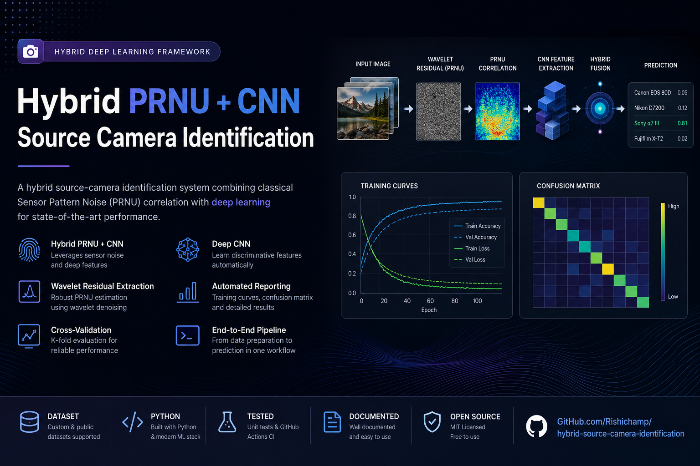
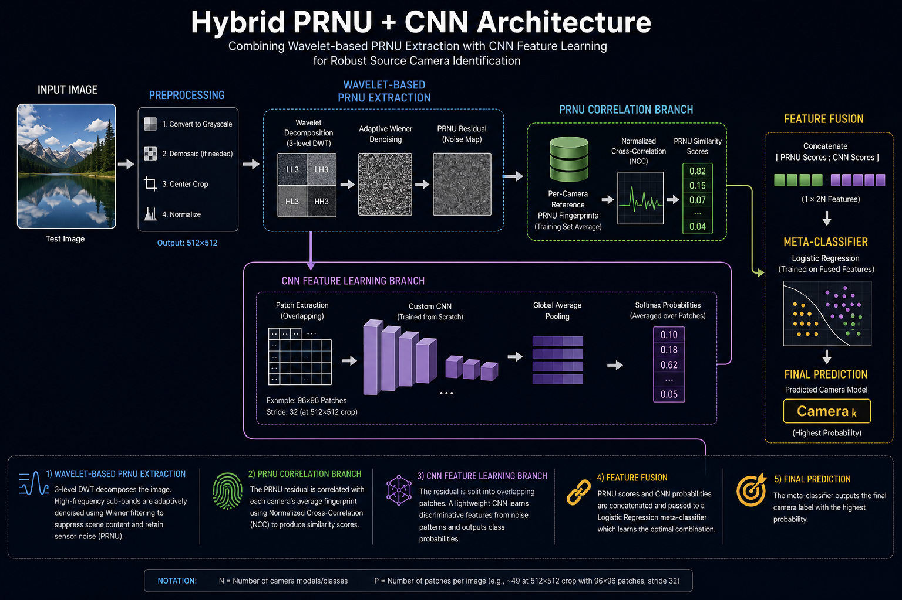
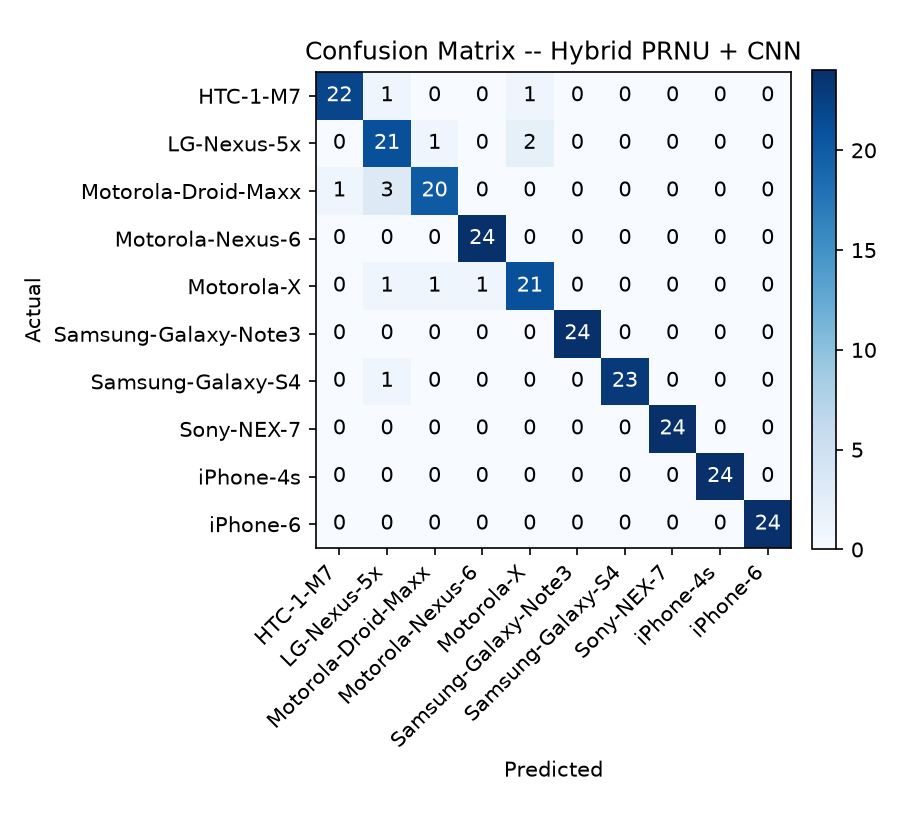
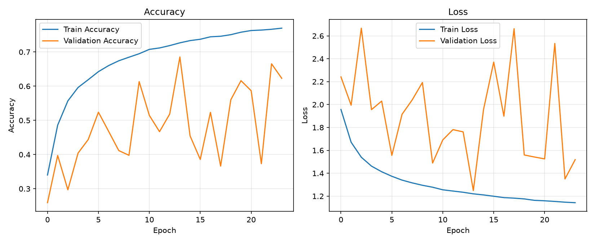

# Source Camera Identification -- Hybrid PRNU + CNN

A hybrid source-camera-identification system combining classical Sensor
Pattern Noise (SPN/PRNU) correlation with a small CNN trained from
scratch, fused via a logistic-regression meta-classifier. Originally a
B.Tech final-year project rebuilt from scratch into a reproducible,
tested, honestly-benchmarked pipeline.

<p align="center">
  
</p>

<h1 align="center">Hybrid PRNU + CNN Source Camera Identification</h1>

<p align="center">
A hybrid deep learning framework that combines Wavelet-based PRNU extraction with CNN feature learning for robust source camera identification in digital image forensics.
</p>

<p align="center">


</p>

---

## Overview

This repository implements a **Hybrid PRNU + CNN** framework for **source camera identification**, combining classical **Photo Response Non-Uniformity (PRNU)** fingerprints with deep convolutional neural network features. The fused representation significantly improves classification accuracy compared with either approach individually, making the system suitable for digital image forensics and camera attribution research.

---

## Architecture

<p align="center">
  
</p>

---

## Table of Contents

- Overview
- Results
- Architecture
- Project Structure
- Installation
- Dataset
- Training
- Cross Validation
- Prediction
- Demo
- Development History
- References
- License

---

## Results

Trained and evaluated on a 10-camera-model dataset (Kaggle's "IEEE's
Signal Processing Society -- Camera Model Identification" set; 200
images/camera after native-resolution cropping -- see [Dataset](#using-a-public-dataset-kaggles-camera-model-identification-set)).

| Metric | Result |
|---|---|
| **5-fold cross-validation accuracy** | **92.17% ± 1.57%** (per-split: 93.75%, 92.50%, 89.17%, 92.92%, 92.50%) |
| Single held-out test-set run | 94.58% |
| -- CNN branch alone | 74.17% |
| -- PRNU-correlation branch alone | 80.00% |
| -- **Hybrid (fused)** | **94.58%** |

**The fusion beats both individual branches by a wide margin** (74.17% /
80.00% standalone vs. 94.58% fused) -- this is the core empirical finding
of the project: the meta-classifier is genuinely combining complementary
signal from each branch, not just picking the better one. See
`reports/results.txt` and `reports/cross_validation.txt` in this repo for
the full, timestamped, unedited output these numbers came from.

<p align="center">


</p>

Every number above is reproducible end-to-end from this repo (see
[Step-by-step guide](#step-by-step-guide)) -- nothing here was hand-tuned
after the fact or selectively reported; `cross_validate.py` and
`hybrid_train.py` append every run's results to `reports/` automatically,
win or lose.

## Development history

This pipeline went through several real, documented iterations -- a naive
Gaussian-blur "SPN" extraction that resized whole photos (destroying the
per-pixel noise it was trying to measure), an ImageNet-pretrained CNN
branch that undertrained on noise data, and three separate memory bugs
surfaced by scaling from 5 to 10 camera classes on real hardware. Every
one of these was root-caused and fixed rather than worked around -- see
[CHANGELOG.md](CHANGELOG.md) for the full account, including what broke,
why, and what the fix actually was. That history is intentionally kept
rather than squashed away: it's a more honest record of how this result
was actually reached.

## Why a redesign, not just fewer images

Fine-tuning DenseNet121's last 15 layers on ~700 training images (v1) was
already showing an overfitting gap between train and validation accuracy.
Doing the same with ~140 training images/class (v2's raw numbers) would be
worse. Rather than "the same model, smaller dataset," this version rethinks
the pipeline around three principles:

1. **Extract a better signal** so the model needs less data to learn from it.
2. **Get more effective samples out of the same images** instead of asking
   for more images.
3. **Use a classical technique that barely needs data at all** for the part
   of the problem it's naturally suited to, instead of asking a CNN to learn
   everything from scratch.

## What's different from v1

| | v1 | v2 (this project) |
|---|---|---|
| Noise extraction | Gaussian blur "high-pass" (crude) | Wavelet-domain adaptive Wiener denoising (Lukás/Fridrich/Goljan-style PRNU) |
| Residual extraction region | Whole image resized to 128x128 | Native-resolution center crop (512x512 default) -- resizing a full photo smears out per-pixel PRNU |
| Backbone | DenseNet121, last 15 layers fine-tuned (~8M+ trainable params) | Small custom CNN, trained fully from scratch (~0.3M params) -- ImageNet features don't transfer well to noise-residual data |
| Input unit | Whole 128x128 image | Multiple 96x96 overlapping patches per image (~49 patches/image at 512x512 crop) |
| Classical PRNU matching | Not used | Per-camera averaged fingerprint + normalized cross-correlation |
| Final decision | CNN softmax only | Stacked meta-classifier (Logistic Regression) fusing PRNU-correlation scores + CNN scores |
| Accuracy estimate | Single train/val/test split | `cross_validate.py` repeats the whole pipeline over multiple seeds -> mean +/- std |

This is essentially the **"Hybrid SPN + CNN"** row from the comparison
table in the original report -- implemented properly, rather than the
CNN-only pipeline that was actually built.

## How the hybrid pipeline works

```
                 ┌─────────────────────────┐
                 │   Wavelet-based PRNU     │
   Input image → │   residual extraction   │
                 └──────────┬──────────────┘
                            │
              ┌─────────────┴─────────────┐
              ▼                           ▼
   ┌────────────────────┐      ┌───────────────────────┐
   │  Correlate against │      │  Split into patches -> │
   │  5 camera reference│      │  custom CNN (scratch)  │
   │  fingerprints       │      │  classifier -> avg.    │
   │  -> 5 scores        │      │  softmax -> 5 scores   │
   └──────────┬──────────┘      └───────────┬────────────┘
              │                              │
              └───────────────┬──────────────┘
                               ▼
                 Logistic Regression meta-classifier
                               │
                               ▼
                     Final predicted camera
```

## Project structure

```
source-camera-id-v2/
├── README.md
├── CHANGELOG.md
├── LICENSE
├── requirements.txt
├── requirements-dev.txt
├── .gitignore
├── .github/workflows/tests.yml       <- CI: runs unit tests on every push
├── data/raw/<one folder per camera>  <- your dataset (any camera names -- auto-discovered)
├── src/
│   ├── prnu_extraction.py            <- wavelet PRNU, native-res center crop, patches,
│   │                                     fingerprints, NCC, CNN input normalization
│   ├── dataset.py                    <- auto-discovers camera classes, fingerprint/classifier
│   │                                     split (returns whole-image residuals, not patches)
│   ├── patch_sequence.py             <- lazily extracts+normalizes patches per training batch
│   │                                     (bounded memory regardless of dataset size)
│   ├── cnn_branch.py                 <- small custom CNN, trained from scratch, regularized
│   ├── hybrid_train.py               <- trains CNN + meta-classifier, evaluates, saves class_names.json
│   ├── cross_validate.py             <- repeated-split robustness check
│   ├── reporting.py                  <- saves training curves / confusion matrix / logs
│   └── predict.py                    <- single-image end-to-end inference
├── tests/                             <- unit tests (no dataset needed), run via pytest
│   ├── test_prnu_extraction.py
│   ├── test_dataset.py
│   ├── test_patch_sequence.py
│   ├── test_hybrid_train.py
│   └── test_prepare_camera_dataset.py
├── scripts/prepare_camera_dataset.py <- shrink a public dataset (e.g. Kaggle's) into
│                                         a small, repo-friendly data/raw/ folder
├── saved_models/                     <- cnn_branch.keras, meta_classifier.joblib,
│                                         fingerprints.npy, class_names.json
├── reports/                           <- auto-generated figures + results logs
├── demo/app.py                       <- free Gradio demo
└── notebooks/
```

## Step-by-step guide

### 1. Environment

```bash
git clone https://github.com/<your-username>/source-camera-id-v2.git
cd source-camera-id-v2
python -m venv .venv && source .venv/bin/activate   # Windows: .venv\Scripts\activate
pip install -r requirements.txt
```

### 2. Add your dataset

You have two options.

**Option A -- your own dataset (as before):** one folder per camera under
`data/raw/`, e.g. `data/raw/Phone_1_Samsung_S3Mini/`. Nothing to edit in
code -- `dataset.py` auto-discovers camera classes from these folder names.

**Option B -- a public benchmark dataset (recommended for pushing accuracy
higher):** see "Using a public dataset" below. This is the path to try if
you want a legitimate shot at 90%+ -- your own small dataset is a
reasonable proof of concept, but accuracy in this problem scales strongly
with how many clean images per camera you have, and public benchmark
datasets have far more.

Either way, this pipeline automatically reserves `--fingerprint-n` images
per camera (default 40) purely for building each camera's PRNU fingerprint,
and uses the rest for the CNN branch's train/val/test split -- you don't
need to separate these yourself.

**Important:** `--crop-size` (default 512) must be smaller than your
source photos' shorter side -- this is a native-resolution crop, not a
resize (see prnu_extraction.py). If your images are unusually small, lower
`--crop-size` accordingly.

## Using a public dataset (Kaggle's Camera Model Identification set)

**Note on Dresden:** the Dresden Image Database used to be the standard
recommendation for this exact task, but multiple independent reports as of
this writing describe its original download host as unreliable/dead. I'm
not sending you to chase a possibly-broken academic mirror.

**Recommended instead: Kaggle's "IEEE's Signal Processing Society - Camera
Model Identification" dataset** (search `sp-society-camera-model
-identification` on kaggle.com, or `kaggle competitions download -c
sp-society-camera-model-identification` via the Kaggle CLI once you've
accepted the competition rules). It's a strong fit for this pipeline:
- **10 distinct camera models, one physical device per model, 275
  full-resolution images/device** (2,750 images total) -- different-*model*
  classification is the easier, better-separated version of this task (the
  kind the original PRNU literature reports near-perfect accuracy on with
  clean data), and it's the same task structure your project already uses.
- It's a real, citable, published benchmark (an actual IEEE-sponsored
  competition), which is a stronger methodology note for a report than an
  unverifiable/dead link.
- Its `train/` folder is already laid out as one subfolder per camera
  model -- exactly what `prepare_camera_dataset.py`'s folders mode expects,
  no reorganizing needed. Verify the exact class folder names once you've
  downloaded it (I'm recalling likely names from the competition's public
  documentation, not re-typing them off a page in front of me) -- either
  way, `dataset.py` auto-discovers whatever folder names actually exist
  under `data/raw/`, so there's nothing to hardcode or edit regardless.

**Don't commit the raw dataset to git.** Even a modest few hundred MB is
more than a git repo should carry, and GitHub actively discourages large
repos. `data/raw/` is already gitignored. Instead:
- Keep your locally-prepared dataset local only.
- Commit `scripts/prepare_camera_dataset.py`, your `saved_models/`
  artifacts, and `reports/` (these are small) -- anyone can reproduce your
  exact dataset by re-running the prep script against the freely
  downloadable Kaggle source. That's a stronger, more professional repo
  than one with a large binary blob in it -- and it sidesteps the
  "1-1.5GB repo" concern entirely, since nothing dataset-sized ever
  touches git.

**Preparing a small, pipeline-ready dataset:** this pipeline only ever
needs a native-resolution center crop of each image (not the whole
multi-megapixel original -- see `prnu_extraction.py`), so
`scripts/prepare_camera_dataset.py` crops each selected image once, up
front, and saves just that crop -- typically shrinking a multi-GB source
down to a few hundred MB with **no loss of PRNU signal quality**, since
the crop is the only part of the image the pipeline would ever look at
anyway.

```bash
cd scripts
# Kaggle's train/ folder is already one subfolder per camera model:
python prepare_camera_dataset.py \
    --input-dir /path/to/sp-society-camera-model-identification/train \
    --output-dir ../data/raw \
    --per-camera 200 --crop-size 768 --jpeg-quality 95 --max-total-mb 1200
```

The script estimates the total output size before writing anything and
aborts if it exceeds `--max-total-mb` (default 1200, i.e. ~1.2GB -- matches
a typical "keep it portfolio-friendly" budget) -- lower `--per-camera`,
`--crop-size`, or `--jpeg-quality` if it does, or pass `--force` to proceed
anyway. Storing crops a bit larger than your training `--crop-size`
(768 stored vs. 512 trained, for example) leaves slack so the pipeline's
own crop never lands right at an edge.

Since only 275 images/device exist in the Kaggle train set, `--per-camera
200` uses most of what's available while leaving some for you to eyeball
manually if something looks off. Then just train -- **no code edits
needed**, `dataset.py` auto-discovers the camera class names from
whatever folders `prepare_camera_dataset.py` produced:

### 3. Train the hybrid pipeline

```bash
cd src
python hybrid_train.py --epochs 40 --batch-size 32 --fingerprint-n 40 --crop-size 512
```

This prints, at the end:
- the fused hybrid accuracy on the held-out test set,
- a full classification report + confusion matrix,
- **diagnostic CNN-only and PRNU-only accuracies**, so you can see exactly
  how much the fusion is helping over either branch alone -- useful for
  your report's "results and analysis" section.

It also **automatically saves**, from this exact run:
- `reports/figures/training_curves.png` -- train/val accuracy & loss vs. epoch
- `reports/figures/confusion_matrix.png` -- a heatmap, ready to drop into
  a report or slide deck
- `reports/results.txt` -- an appended, timestamped log of every run's
  accuracy numbers and classification report

These are generated straight from whatever the pipeline actually measures
on your images -- there's nothing to fill in by hand, and every run keeps
its own timestamped record in `results.txt`, so the numbers in your final
report can be traced back to a specific run.

Artifacts saved to `saved_models/`: `cnn_branch.keras`,
`meta_classifier.joblib`, `fingerprints.npy`.

### 4. Get an honest accuracy estimate (recommended given the small dataset)

```bash
python cross_validate.py --n-splits 5 --epochs 25
```
Repeats the entire pipeline (new fingerprint set, new CNN training, new
meta-classifier) across 5 random splits and reports mean +/- std accuracy --
much more defensible in a viva/report than a single run's number, especially
at this dataset size. Also appends a summary to `reports/cross_validation.txt`.

### 5. Run the unit tests (optional, but recommended before you rely on results)

```bash
pip install -r requirements-dev.txt
cd src && python -m pytest ../tests -v
```
These check the core PRNU math (residual extraction, patching, fingerprint
correlation) and specifically guard against the CNN-input normalization
bug fixed in v2.1 re-appearing. They run in seconds and don't need your
dataset. A GitHub Actions workflow (`.github/workflows/tests.yml`) runs
them automatically on every push.

### 6. Predict on a new image

```bash
python predict.py --image /path/to/photo.jpg
```
Prints the fused prediction plus both branches' raw scores, so you can see
*why* it decided what it decided (e.g. "PRNU strongly favored Phone 3, CNN
was split between Phone 3 and Phone 4, fused decision: Phone 3").

### 7. Free interactive demo

```bash
cd ..
python demo/app.py
```
Or deploy for free on Hugging Face Spaces (same steps as v1's README):
create a Gradio Space, push `demo/app.py`, `requirements.txt`, `src/`, and
your `saved_models/` artifacts.

### 8. Publish to GitHub

```bash
git init && git add . && git commit -m "Hybrid PRNU + CNN source camera identification (refined, low-data)"
git branch -M main
git remote add origin https://github.com/<your-username>/source-camera-id-v2.git
git push -u origin main
```

## Notes on the design choices

- **Why patches instead of whole images for the CNN branch**: PRNU is a
  pixel-level statistical property, not a global shape feature -- a network
  doesn't need to see a whole photo to estimate whether its noise matches a
  camera. Patches let you extract that signal repeatedly from one image,
  which is exactly the multiplier a small dataset needs.
- **Why the fingerprint set is separate from the CNN's data**: building a
  PRNU fingerprint by averaging isn't "training" in the overfitting sense
  (scene content cancels out, sensor pattern doesn't), so it's safe to treat
  those images as free extra evidence rather than data the CNN branch is
  competing for.
- **Why Logistic Regression for the meta-classifier, not another CNN**: with
  only 10 input features (5 correlation scores + 5 CNN scores) and a few
  hundred image-level training examples, a linear model is the right
  complexity level -- anything fancier risks overfitting the fusion step
  itself.

## Limitations (carried over, still true)

- Closed-set: recognizes only the 5 specific physical devices trained on.
- PRNU-style methods remain sensitive to heavy compression/cropping.
- 200 images/camera is workable with this design, but more data (especially
  more fingerprint-building images) would still likely improve results
  further -- if you can collect more later, raising `--fingerprint-n` first
  is the highest-leverage change.

## A note on reporting results

Every accuracy number in this README's examples is illustrative, not a
promise -- your real number depends on your dataset, hardware, and
randomness. `hybrid_train.py` and `cross_validate.py` write their output
straight to `reports/` from the actual run, with a timestamp, so whatever
ends up in your project report or slides can be traced back to a specific
execution of the code. If a reviewer or examiner asks "can you show me
this run," `reports/results.txt` (or `cross_validation.txt`) is the answer
-- that traceability is worth more for your grade and your credibility
than a slightly higher number would be, and it's also just less stressful
to defend in a viva.

## References

1. Lukás, J., Fridrich, J., & Goljan, M. (2006). Digital camera
   identification from sensor pattern noise. *IEEE TIFS*, 1(2), 205-214.
2. Mihcak, M. K., Kozintsev, I., & Ramchandran, K. (1999). Spatially
   adaptive statistical modeling of wavelet image coefficients and its
   application to denoising. *ICASSP*.
3. Huang, G., et al. (2017). Densely connected convolutional networks
   (context for why v1 used DenseNet121). *CVPR*.

## License

MIT -- see [LICENSE](LICENSE).
